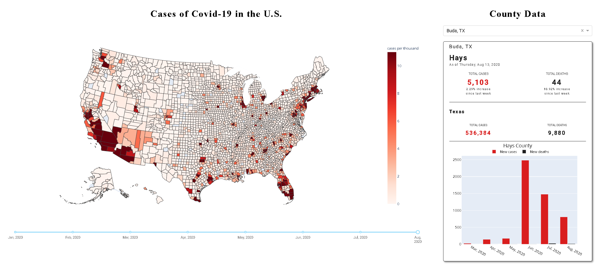

# Covid19 visual dashboard with Plotly Dash

Curious to see a timeline of Covid19 in the U.S. I decided to start on this little dashboard project. We'll be creating an interactive choropleth map of U.S. counties with approximate Covid19 data from *The New York Times*. In addition to the choropleth map we will also be creating an interactive dashboard that will allow you to select a city and then, based off the selected city, display county and state data. The end product will look like this:


Before we get into the code here is the libraries used for this project:
```python
import dash
import dash_core_components as dcc
import dash_html_components as html
from dash.dependencies import Input, Output
import plotly.express as px
import plotly.graph_objects as go

import pandas as pd
import json
from urllib.request import urlopen
from datetime import datetime, timedelta
from random import randrange
```

## 1. Data Collection ##
For this project I was needing a dataset that at the very least had this data:
- Date
- FIPS
- County
- State
- Cases
- Deaths

### 1.1 Covid19 data collection ###
After some research I decided to use a dataset from *The New York Times* which is hosted on their github [here](https://raw.githubusercontent.com/nytimes/covid-19-data/master/us-counties.csv). It is important to be able to reference this CSV file via URL so that way all data stays up-to-date.
```python
url = 'https://raw.githubusercontent.com/nytimes/covid-19-data/master/us-counties.csv'
covid19_df = pd.read_csv(url, dtype={'fips': str})
```

### 1.2 Cities data collection ###
The Covid19 dataset from *The New York Times* didn't include any State IDs or associated cities for each county, which is understandable. So, I went ahead and found a dataset from [*Simplemaps*](https://simplemaps.com/data/us-cities) which includes cities with their associated State ID, state name, county name, and fips. This dataset also contains other information, but that is the only data we will need to make our city selector, via dropdown menu, work. There was no option to reference this CSV via URL so I had to download the file which is fine because all of the data is static.
```python
cols = ['city', 'county_name', 'state_id', 'state_name']
cities_df = pd.read_csv('uscities.csv', usecols=cols)
```

## 2. Data Exploration ##
Let’s take a look at our datasets and get to know our data before we go any further. By doing this we can find potential problems with our data that we'll have to fix as well as uncover some data trends and insights.

## 2.1 Cities data exploration ##
There is nothing really special about this dataset and everything is static so here are the columns I decided to include in the dataframe.
```python
print(cities_df.columns)
```
The above code outputs:
```
Index(['city', 'state_id', 'state_name', 'county_fips', 'county_name'], dtype='object')
```

### 2.2 Covid19 data exploration ###
It's always a good idea to look at our data types for each column and determine if any data types will need to be changed.
```python
print(covid19_df.dtypes)
```
The above code outputs:
```
date      object
county    object
state     object
fips      object
cases      int64
deaths     int64
dtype: object
```
From the results we now know that the date column is not a datetime data type, we will have to fix that later to allow for easy date filtering. Our county, state, and fips columns are actually strings but are given the object data type because they all have different lengths, no conflict here. Lastly our cases and deaths columns are integers, so nothing needs to change here.

Let's see what the date range is for our data.
```python
print(df.date.min())
print(df.date.max())
```
The above code outputs:
```
2020-01-21 00:00:00
2020-08-11 00:00:00
```
Based off the results, our data starts on January 21, 2020 and the most recent update was on August 11, 2020. Today is August 12, 2020 so our data will always be one day behind the current date.

I think it would be interesting to see what are the top 10 leading counties are as far as total number of cases and deaths.
```python
unique_counties = df['county'].unique().tolist()
county_grp = df.groupby('county')

frame = {'county': unique_counties, 'state': [], 'max_cases': [], 'max_deaths': []}
for i in unique_counties:
    frame['state'].append(county_grp.get_group(i).state.iloc[0])
    frame['max_cases'].append(county_grp.get_group(i).cases.max())
    frame['max_deaths'].append(county_grp.get_group(i).deaths.max())

county_df = pd.DataFrame(frame)

print(county_df.nlargest(10, 'max_cases'))
print('---------------------------------------------------------')
print(county_df.nlargest(10, 'max_deaths')[['county', 'state', 'max_deaths', 'max_cases']])
```
The above code outputs:
```
            county          state  max_cases  max_deaths
25   New York City       New York     233030       23592
4      Los Angeles     California     211808        5057
152     Miami-Dade        Florida     135129        1909
3         Maricopa        Arizona     126791        2382
1             Cook       Illinois     112485        4933
47          Harris          Texas      87505        1616
53         Broward        Florida      63605         856
143         Dallas          Texas      55553         785
43           Clark         Nevada      49646         828
6          Suffolk  Massachusetts      43893        2044
---------------------------------------------------------
            county          state  max_deaths  max_cases
25   New York City       New York       23592     233030
4      Los Angeles     California        5057     211808
1             Cook       Illinois        4933     112485
65           Wayne   Pennsylvania        2830      28448
45          Nassau       New York        2706      43724
3         Maricopa        Arizona        2382     126791
132          Essex  Massachusetts        2113      20015
35          Bergen     New Jersey        2046      21115
6          Suffolk  Massachusetts        2044      43893
42       Middlesex  Massachusetts        2006      26565
```
New York City is not a county, we will need to fix that later, but it is the leading county for most cases and deaths followed by Los Angeles county.

Now instead of counties let's get the top 10 leading states for total number of cases and deaths.
```python
# References county_df dataframe from previous code snippet
unique_states = county_df['state'].unique().tolist()
state_grp = county_df.groupby('state')

frame = {'state': unique_states, 'total_cases': [], 'total_deaths': []}
for i in unique_states:
    frame['total_cases'].append(state_grp.get_group(i).max_cases.sum())
    frame['total_deaths'].append(state_grp.get_group(i).max_deaths.sum())

state_df = pd.DataFrame(frame)

print(state_df.nlargest(10, 'total_cases'))
print('-------------------------------------------')
print(state_df.nlargest(10, 'total_deaths')[['state', 'total_deaths', 'total_cases']])
```
The above code outputs:
```
            state  total_cases  total_deaths
2      California       587217         10707
10        Florida       459641          7440
6           Texas       449643          8073
11       New York       364617         30263
13        Georgia       190885          3981
1        Illinois       176319          7049
3         Arizona       174454          3863
16     New Jersey       145048         12030
4   Massachusetts       144932         10573
26   Pennsylvania       132516          8747
---------------------------------------------
            state  total_deaths  total_cases
11       New York         30263       364617
16     New Jersey         12030       145048
2      California         10707       587217
4   Massachusetts         10573       144932
26   Pennsylvania          8747       132516
6           Texas          8073       449643
10        Florida          7440       459641
1        Illinois          7049       176319
33    Connecticut          4253        49033
13        Georgia          3981       190885
```
California leads with the most cases by over 120k cases, while New York leads with the most deaths by over 180k deaths.

### 2.2.1 Covid19 bad data ###
Now that we've had some fun with our data, let's figure out if there is any part of our data that needs cleaning.

It's pretty common for datasets to have NaN values, let's check if any columns contain any NaN values.
```python
cols = df.columns.tolist()
print('NaN values?')
for col in cols:
    print(f'{col} column:\t{df[col].isna().values.any()}')
```
The above code outputs:
```
NaN values?
date column:	False
county column:	False
state column:	False
fips column:	True
cases column:	False
deaths column:	False
```
Out of our columns, only the fips column contains NaN values. To see all rows where the fips column is NaN we can do something like this.
```python
nan_fips_filt = df.fips.isna()
nan_df = df[nan_fips_filt]
print(nan_df)
```
The above code outputs:
```
              date         county         state fips  cases  deaths
416     2020-03-01  New York City      New York  NaN      1       0
418     2020-03-01        Unknown  Rhode Island  NaN      2       0
448     2020-03-02  New York City      New York  NaN      1       0
450     2020-03-02        Unknown  Rhode Island  NaN      2       0
482     2020-03-03  New York City      New York  NaN      2       0
...            ...            ...           ...  ...    ...     ...
423782  2020-08-11        Unknown  Rhode Island  NaN   2193      15
424263  2020-08-11        Unknown          Utah  NaN     16       0
424280  2020-08-11        Unknown       Vermont  NaN      8       0
424454  2020-08-11        Unknown    Washington  NaN      2       2
424577  2020-08-11        Unknown     Wisconsin  NaN   4202       7

[4222 rows x 6 columns]
```
It looks like there are instances where the county is "Unknown" and the FIPS is NaN. This is a big issue because without either of those values it's impossible to figure out what county this data should be going to. As long as there is a valid county value or FIPS value, we can figure out one value from the other.

Let's display the unique values and their counts for the county column.
```python
print(nan_df['county'].value_counts())
```
The code above outputs:
```
Unknown          3865
New York City     164
Kansas City       145
Joplin             48
Name: county, dtype: int64
```
So, there are three valid county values that have FIPS values of NaN. 
1. New York City
	- New York City doesn't work because it is a city, not a county. The associated county for New York City is New York county.
2. Kansas City
	- Kansas City doesn't work because it is a city, not a county. After some research I found out that Kansas City is a city which spans across the Kansas and Missouri state borders, as well as county borders.

3. Joplin
	- Joplin doesn't work because there it is a city in Missouri, not a county. After some research Joplin spans across two conties, Jasper and Newton.

All of these issues will need to be fixed during the data cleaning process.

## 3. Data Cleaning ##
During our data exploration we found out that we'll need to clean up a few things like:
- Make date column a datetime data type instead of object
- Remove all rows where the county value is "Unknown" and the FIPS value is NaN
- Correct county and fips value where the county value is "New York City", "Kansas City", and "Joplin".

### 3.1 Datetime data type ###
To change a column to a datetime data type we can use pandas *to_datetime* method like so.
```python
df['date'] = pd.to_datetime(df['date'])
print(df.date.dtype)
```
The above code outputs:
```
datetime64[ns]
```

### 3.2 Removing all unusable rows ###
Since there is no way of knowing where the cases and deaths data should go to for those rows with an "Unknown" county value and a NaN FIPS value, we just have to drop those rows and play with what we have left. To drop all of these rows we can do something like this.
```python
unknown_filt = nan_df.county == 'Unknown'
idxs = nan_df[unknown_filt].index.tolist()
df.drop(df.index[idxs], inplace=True)

unknown_filt = df.county == 'Unknown'
print(df[unknown_filt])
```
The above code outputs:
```
Empty DataFrame
Columns: [date, county, state, fips, cases, deaths]
Index: []
```

### 3.3 Correcting county value and adding FIPS value ###
There are three counties that need to be fixed and all three need the correct county and FIPS value:
1. New York City
	- We'll just correct the county and FIPS value
2. Kansas City
	- After some research Google's Covid-19 data for Kansas City doesn't seem to exist in Wyandotte county, Kansas, or in Jackson county, Missouri. Looking at some maps it seems that Kansas City, MO is much larger and more populated that Kansas City, KS. I could just do like Google did and leave out the data, but I am going to go ahead and assign the data to Jackson county.
3. Joplin
	- After doing some research I found out that Joplin, MO is majority in Jasper county vs. Newton county. However, Google's Covid-19 data doesn't assign a county for Joplin, MO (much like Kansas City). I could just do like they did and leave out the data, but I am going to make another executive decision and assign the data to Jasper county.
We'll use a for loop to fix this data.
```python
bad_counties_dict = {'New York City': {'county': 'New York', 'state': 'New York'}, \
                   'Kansas City': {'county': 'Jackson', 'state': 'Missouri'}, \
                   'Joplin': {'county': 'Jasper', 'state': 'Missouri'}}

nan_filt = df.fips.isnull()
for val in bad_counties_dict.items():
    city = val[0]
    county = val[1].get('county')
    state = val[1].get('state')
    
    if city == 'New York City':
        city_filt = (cities_df.city == county) & (cities_df.state_name == state)
    else:
        city_filt = (cities_df.city == city) & (cities_df.state_name == state)
    county_filt = (df.county == county) & (df.state == county)
    
    df.county.replace(city, county, inplace=True)
    fips = cities_df[city_filt]['county_fips'].sum()
    df.loc[df.county == county, 'fips'] = fips
    
print(df[nan_filt])
```
The above code outputs:
```
Empty DataFrame
Columns: [date, county, state, fips, cases, deaths]
Index: []
```
We know this worked because there are no more NaN values in the FIPS column.

### 3.4 Adding custom columns ###
Since we will be creating a drop down menu based if city and state, there has to be a way for our two dataframes to reference each other off of a similar value. Currently there is no such reference, so we will just need to create some new columns.

What new columns do we need?
1. Covid-19 dataframe
	- a formatted county state name "County, State" (to reference cities dataframe)
	- a formatted date "Month(abbr), Year" (for choropleth map slider and data updates)
	- a smaller cases range, 0-11 cases per thousand (legend for choropleth map)
2. Cities dataframe
	- a formatted county state name "County, State" (to reference covid-19 dataframe)
	- a formatted city state abbreviation name "City, St" (for the city selector drop down menu)

Let's first create the new columns for the Covid-19 dataframe
```python
df['month_year'] = df['date'].dt.strftime('%b, %Y')
df['county_state'] = df['county'] + ', ' + df['state']
df['cases_range'] = [x / 1_000 for x in df['cases']]

print(df[['month_year', 'county_state', 'cases_range']].head(), '\n')
print(df.dtypes)
```
The above code outputs:
```
  month_year           county_state  cases_range
0  Jan, 2020  Snohomish, Washington        0.001
1  Jan, 2020  Snohomish, Washington        0.001
2  Jan, 2020  Snohomish, Washington        0.001
3  Jan, 2020         Cook, Illinois        0.001
4  Jan, 2020  Snohomish, Washington        0.001 

date            datetime64[ns]
county                  object
state                   object
fips                    object
cases                    int64
deaths                   int64
month_year              object
county_state            object
cases_range            float64
dtype: object
```

Next let's create the new columns for the cities dataframe
```python
cities_df['city_state_abbr'] = cities_df['city'] + ', ' + cities_df['state_id']
cities_df['county_state'] = cities_df['county_name'] + ', ' + cities_df['state_name']

print(cities_df[['city_state_abbr', 'county_state']].head(), '\n')
print(cities_df.dtypes)
```
The above code outputs:
```
    city_state_abbr           county_state
0   South Creek, WA     Pierce, Washington
1        Roslyn, WA   Kittitas, Washington
2       Sprague, WA    Lincoln, Washington
3    Gig Harbor, WA     Pierce, Washington
4  Lake Cassidy, WA  Snohomish, Washington 

city               object
state_id           object
state_name         object
county_fips         int64
county_name        object
city_state_abbr    object
county_state       object
dtype: object
```

Finally we need to create a dictionary that has "Month(abbr), Year" as the keys and integers starting from 1 as the keys. This will be used later with the slider to reference "Month(abbr), Year" with whatever integer the slider is set to.
```python
month_year_dict = {i+1: month_year for i, month_year in enumerate(df.month_year.unique().tolist())}
print(month_year_dict)
```
The above code outputs:
```
{1: 'Jan, 2020', 2: 'Feb, 2020', 3: 'Mar, 2020', 4: 'Apr, 2020', 5: 'May, 2020', 6: 'Jun, 2020', 7: 'Jul, 2020', 8: 'Aug, 2020'}
```

## 4. Creating the Dash App ##
Now that all of our data cleaning is done, we can began building our Dash app! The first thing you will need to do is create an app variable.
```python
app = dash.Dash(__name__)
```

### 4.1 App Layout ###
In Plotly Dash the, app layout is basically the html that structures what the app looks like. You can add any html element you want and style it as well. This readme would be ridiculously long if I tried to explain everything I did in the app layout, so all you need to know is that the below code creates the layout for the app.
```python
# Create the layout for the dash app
app.layout = html.Div([
    # Choropleth map with slider
    html.Div([
        html.H1('Cases of Covid-19 in the U.S.', style={'text-align': 'center', 'font-family': 'Roboto Bold', 'letter-spacing': '2px'}),
        dcc.Graph(id='choropleth-with-slider'),
        dcc.Slider(
            id='month-year-slider',
            min=1,
            max=len(month_year_dict),
            value=len(month_year_dict),
            marks=month_year_dict,
            step=None)],
        style={'display': 'inline-block', 'width': '70%', 'padding-left': '20px', 'font-family': 'Roboto'}
    ),
    
    # County data header and drop down
    html.Div([
        html.H1('County Data', style={'text-align': 'center', 'font-family': 'Roboto Bold', 'letter-spacing': '2px'}),
        # Cities drop down menu
        html.Div([
            dcc.Dropdown(
                id='city-selector',
                options=[{'label': i, 'value': i} for i in cities_df.city_state_abbr],
                placeholder='Select a city')],
            style={'font-family': 'Roboto'}
        ),
        
        # County data and stats
        html.Br(),
        html.Div([
            
            # Displays selected "City, State"
            html.Div([
                html.P('City, State', id='city-state-name', style={'color': '#c2c2c2'})],
                style={'line-height': '15%', 'font-family': 'Roboto Light', 'font-weight': '800'}
            ),
            
            # Displays "County" based off selected city
            html.Div([
                html.H2('County', id='county-name', style={'color': '#c2c2c2'})],
                style={'line-height': '7%', 'padding-top': '.04px', 'font-family': 'Roboto Medium'}
            ),
            
            # Displays the most recent date that data was aquired
            html.Div([
                html.P('As of', id='most-recent-date', style={'color': '#c2c2c2'})],
                style={'font-size': '70%', 'line-height': '70%', 'font-family': 'Roboto Light', 'letter-spacing': '1px'}
            ),
            
            # Displays cases amd deaths county data
            html.Div([
                
                # Displays headers above cases and deaths count
                html.Div([
                    html.Small('TOTAL CASES', id='county-cases-label', style={'color': '#c2c2c2'}),
                    html.Small('TOTAL DEATHS', id='county-deaths-label', style={'color': '#c2c2c2'})
                ],
                # style for text "cases" and total cases
                style={'display': 'grid', 'grid-template-columns': '1fr 1fr', 'grid-gap': '70px', \
                       'font-family': 'Roboto Light', 'font-size': '85%', 'padding-top': '10px'}
                ),
                
                # Displays the total cases and deaths for the county
                html.Div([
                    # Total cases
                    html.Div([
                        html.H2('0', id='county-cases', style={'color': '#c2c2c2'})]),
                    # Total deaths
                    html.Div([
                        html.H2('0', id='county-deaths', style={'color': '#c2c2c2'})])
                ],
                style={'line-height': '20%', 'display': 'grid', 'grid-template-columns': '1fr 1fr', \
                       'grid-gap': '70px', 'letter-spacing': '3px', 'font-family': 'Roboto Medium', 'font-weight': '2500'}
                ),
                
                # Displays the increased or decreased percentage
                html.Div([
                    html.Small('% increase', id='cases-pct', style={'color': '#c2c2c2'}),
                    html.Small('% increase', id='deaths-pct', style={'color': '#c2c2c2'})
                ],
                style={'display': 'grid', 'grid-template-columns': '1fr 1fr', 'grid-gap': '70px', \
                       'line-height': '25%', 'padding-bottom': '20px', 'font-family': 'Roboto', \
                       'font-size': '80%', 'letter-spacing': '1px'}
                ),
                
                # Display a date to reference for an increase or decrease
                html.Div([
                    html.Small('since', id='cases-pct-date', style={'color': '#c2c2c2'}),
                    html.Small('since', id='deaths-pct-date', style={'color': '#c2c2c2'})
                ],
                style={'display': 'grid', 'grid-template-columns': '1fr 1fr', 'grid-gap': '70px', \
                       'line-height': '25%', 'padding-bottom': '20px', 'font-family': 'Roboto', \
                       'font-size': '80%', 'letter-spacing': '1px', 'margin-top': '-8px'}
                )
            ],
            style={'justify-content': 'center', 'width': '100%', 'text-align': 'center'}
            ),
            
            # Thematic break
            html.Hr(style={'border-top': '1px solid'}),
            
            # Displays the state of the selected city
            html.Div([
                html.H4('State', id='state-name', style={'color': '#c2c2c2'})
            ],
            style={'font-family': 'Roboto Medium'}
            ),
            
            # State data
            html.Div([
                
                # Display headers for state cases and deaths
                html.Div([
                    html.Small('TOTAL CASES', id='state-cases-label', style={'color': '#c2c2c2', 'font-size': '70%'}),
                    html.Small('TOTAL DEATHS', id='state-deaths-label', style={'color': '#c2c2c2', 'font-size': '70%'})
                ],
               style={'display': 'grid', 'grid-template-columns': '1fr 1fr', 'grid-gap': '70px', \
                       'font-family': 'Roboto Light', 'font-size': '85%', 'padding-top': '10px'}
                ),
                
                # Display the total cases and deaths for the state
                html.Div([
                    # Total cases
                    html.Div([
                        html.H3('0', id='state-cases', style={'color': '#c2c2c2'})]),
                    # Total deaths
                    html.Div([
                        html.H3('0', id='state-deaths', style={'color': '#c2c2c2'})])
                ],
                style={'line-height': '20%', 'display': 'grid', 'grid-template-columns': '1fr 1fr', \
                       'grid-gap': '70px', 'letter-spacing': '3px', 'font-family': 'Roboto Medium', 'font-weight': '100'}
                )
            ],
            style={'justify-content': 'center', 'width': '100%', 'text-align': 'center'}
            ),
            
            # Inserting thematic break followed by a barchart of monthly data on the specified county
            html.Div([
                html.Hr(style={'border-top': '1px solid'}),
                dcc.Graph(id='bar-chart')
            ],
            style={'height': '60%'}
            )
        ],
        # border for data section
        style={'border': '1px solid black', 'border-radius': '5px', 'box-shadow': '3px 3px 5px #888888', 'padding-left': '20px', 'padding-right': '20px'}
        )
    ],
    # style for right side html.Div
    style={'float': 'right', 'display': 'inline-block', 'width': '25%', 'padding-right': '20px'}
    ),
    
], 
# stlye for entire app
style={'autosizable': 'True', 'height': '100%', 'padding-bottom': '20px'}
)
```

### 4.2 App Callbacks ###
Dash app callbacks are basically JavaScript functions for our app. I have several app callbacks that are used to update the choropleth map, a barchart, as well as county and state data.

### 4.2.1 Callback - Choropleth Update ###
Using plotly express we can make a good looking choropleth map of the U.S. with our Covid-19 data. Since this is an app callback, every time the slider changes positions the choropleth map will update its data to match the slider formatted "Month(abbr), Year" date.
```python
@app.callback(
    Output('choropleth-with-slider', 'figure'),
    [Input('month-year-slider', 'value')])

def update_choropleth(set_month_year):
    filtered_df = df[df.month_year == month_year_dict.get(set_month_year)]
    
    fig = px.choropleth(filtered_df,
        geojson=counties,
        locations='fips', 
        color='cases_range',
        color_continuous_scale='reds',
        scope='usa',
        hover_name='county_state',
        hover_data={'cases': True, 'deaths': True, 'fips': False, 
                    'month_year': False,'county': False, 'cases_range': False},
        range_color=(0, 11),
        height=700,
        labels={'cases_range':'cases per thousand'},
        template='plotly')
    
    fig.update_layout(transition_duration=500)
    
    return fig
```

### 4.2.2 Callback - Update County Data ###
This callback is used to populate and update all of our county data based off of city selected and the "Month(abbr), Year" selected on the slider.
```python
@app.callback(
    [Output('county-name', 'children'),
     Output('county-name', 'style'),
     Output('city-state-name', 'children'),
     Output('city-state-name', 'style'),
     Output('county-cases', 'children'),
     Output('county-cases', 'style'),
     Output('county-cases-label', 'style'),
     Output('county-deaths', 'children'),
     Output('county-deaths', 'style'),
     Output('county-deaths-label', 'style'),
     Output('cases-pct', 'children'),
     Output('cases-pct', 'style'),
     Output('deaths-pct', 'children'),
     Output('deaths-pct', 'style'),
     Output('cases-pct-date', 'children'),
     Output('cases-pct-date', 'style'),
     Output('deaths-pct-date', 'children'),
     Output('deaths-pct-date', 'style'),
     Output('most-recent-date', 'children'),
     Output('most-recent-date', 'style')],
    [Input('city-selector', 'value'),
     Input('month-year-slider', 'value')])

def get_county_data(selected_city, set_month_year):
    if selected_city != None:
        city_filt = cities_df['city_state_abbr'] == selected_city
        county = cities_df[city_filt].iloc[0]['county_name']
        county_state = cities_df[city_filt].iloc[0]['county_state']
        city_group = df.groupby('county_state')

        if set_month_year != len(month_year_dict):
            current_data = False
        else:
            current_data = True

        try:
            city_df = city_group.get_group(county_state)
            month_year_filt = city_df['month_year'] == month_year_dict.get(set_month_year)
            city_month_df = city_df[month_year_filt]

            city_month_df['new_cases'] = [(val - city_month_df.iloc[i-1]['cases']) if i != 0 else val for i, val in enumerate(city_month_df['cases'])]
            city_month_df['new_deaths'] = [(val - city_month_df.iloc[i-1]['deaths']) if i != 0 else val for i, val in enumerate(city_month_df['deaths'])]

            if len(city_month_df) == 0:
                month_year_filt = df['month_year'] == month_year_dict.get(set_month_year)
                max_date = df[month_year_filt]['date'].max()
            else:
                max_date = city_month_df.date.max()
            
            if current_data:
                compare_date = max_date - timedelta(days=7)
                compare_filt = city_month_df['date'] <= compare_date
                old_cases = city_month_df[compare_filt]['new_cases'].sum()
                old_deaths = city_month_df[compare_filt]['new_deaths'].sum()
            else:
                compare_date = df.date.max()
                old_cases = city_df['cases'].max()
                old_deaths = city_df['deaths'].max()

            current_filt = city_month_df['date'] <= max_date
            new_cases = city_month_df[current_filt]['new_cases'].sum()
            new_deaths = city_month_df[current_filt]['new_deaths'].sum()

            if current_data:
                cases_change = new_cases - old_cases
                deaths_change = new_deaths - old_deaths
            else:
                cases_change = old_cases - new_cases
                deaths_change = old_deaths - new_deaths

            cases_pct = round(((cases_change / old_cases) * 100), 2)
            deaths_pct = round(((deaths_change / old_deaths) * 100), 2)
            
            if len(city_month_df) == 0:
                max_cases = 0
                max_deaths = 0
            else:
                month_number = datetime.strptime(month_year_dict.get(set_month_year), "%b, %Y").month
                my_filt = city_month.date.dt.month <= month_number
                
                max_cases = city_month_df[my_filt].cases.max()
                max_deaths = city_month_df[myfilt].deaths.max()
            
            filt_max_date = max_date.strftime('%A, %b %d, %Y')

            key_error = False
    
        except KeyError:
            month_year_filt = df['month_year'] == month_year_dict.get(set_month_year)
            filt_max_date = (df[month_year_filt]['date'].max()).strftime('%A, %b %d, %Y')
            key_error = True

        most_recent_date = df.date.max().strftime('%b %d, %Y')
        name_style = {'color': '#1f1f1f', 'letter-spacing': '2px'}
        cases_style = {'color': '#d91e1e'}
        deaths_style = {'color': '#1f1f1f'}
        label_style = {'color': '#1f1f1f'}

        if key_error:
            if current_data:
                pct = '0% increase'
                pct_date = 'since last week'
            else:
                pct = '0% decrease'
                pct_date = f'since {most_recent_date}'
            return county, name_style, selected_city, name_style, 0, cases_style, label_style, 0, deaths_style, label_style, pct, label_style, pct, label_style, pct_date, label_style, pct_date, label_style, f'As of {filt_max_date}', label_style
        else:
            if current_data:
                return  county, name_style, selected_city, name_style, ('{:,}'.format(max_cases)), cases_style, label_style, ('{:,}'.format(max_deaths)), deaths_style, label_style, \
                        f'{cases_pct}% increase', label_style, f'{deaths_pct}% increase', label_style, \
                        'since last week', label_style, 'since last week', label_style, f'As of {filt_max_date}', label_style
            else:
                 return county, name_style, selected_city, name_style, ('{:,}'.format(max_cases)), cases_style, label_style, ('{:,}'.format(max_deaths)), deaths_style, label_style, \
                        f'{cases_pct}% decrease', label_style, f'{deaths_pct}% decrease', label_style, f'since {most_recent_date}', \
                        label_style, f'since {most_recent_date}', label_style, f'As of {filt_max_date}', label_style
        
    else:
        style = {'color': '#c2c2c2'}
        pct = '% increase'
        pct_date = 'since'
        return 'County', style, 'City, State', style, 0, style, style, 0, style, style, pct, style, pct, style, pct_date, style, pct_date, style, 'As of', style
```

### 4.2.3 Callback - Update State Data ###
This callback is used to populate and update all of our state data based off of city selected and the "Month(abbr), Year" selected on the slider.
```python
@app.callback(
    [Output('state-name', 'children'),
     Output('state-name', 'style'),
     Output('state-cases', 'children'),
     Output('state-cases', 'style'),
     Output('state-cases-label', 'style'),
     Output('state-deaths', 'children'),
     Output('state-deaths', 'style'),
     Output('state-deaths-label', 'style')],
    [Input('city-selector', 'value'),
     Input('month-year-slider', 'value')])

def get_state_data(selected_city, set_month_year):
    if selected_city != None:
        city_grp = cities_df.groupby('city_state_abbr')
        state = city_grp.get_group(selected_city).iloc[0]['state_name']
        state_grp = df.groupby('state')
        state_df = state_grp.get_group(state)
        month_year_filt = state_df['month_year'] == month_year_dict.get(set_month_year)
        length = len(state_df[month_year_filt])

        state_month_df = state_df[month_year_filt]
        unique_counties = state_month_df.county.unique()

        state_cases = 0
        state_deaths = 0
        for county in unique_counties:
            county_filt = state_month_df['county'] == county
            state_cases += state_month_df[county_filt]['cases'].max()
            state_deaths += state_month_df[county_filt]['deaths'].max()
        
        state_style = {'color': '#1f1f1f', 'letter-spacing': '2px'}
        cases_style = {'color': '#d91e1e'}
        deaths_style = {'color': '#1f1f1f'}
        label_style = {'color': '#1f1f1f', 'font-size': '70%'}
        return state, state_style, ('{:,}'.format(state_cases)), cases_style, label_style, ('{:,}'.format(state_deaths)), deaths_style, label_style
    
    else:
        style1 = {'color': '#c2c2c2'}
        style2 = {'color': '#c2c2c2', 'font-size': '70%'}
        return 'State', style1, 0, style1, style2, 0, style1, style2
```

### 4.2.3 Callback - Create and Update Bar Chart ###
Creating a bar chart from random county data until a city is selected. Displays the number of new cases and deaths per month, for a county.
```python
@app.callback(
    Output('bar-chart', 'figure'),
    [Input('city-selector', 'value')])

def update_bar(selected_city):
    dummy_city = False
    if selected_city == None:
        rand = randrange(len(cities_df))
        dummy_city = True
        selected_city = cities_df.iloc[rand]['city_state_abbr']
    
    city_filt = cities_df['city_state_abbr'] == selected_city
    county = cities_df[city_filt].iloc[0]['county_name']
    county_state = cities_df[city_filt].iloc[0]['county_state']

    try:
        county_group = df.groupby('county_state')
        county_df = county_group.get_group(county_state)
        county_df['month_year'] = [i.strftime('%b, %Y') for i in county_df['date']]
        county_df['new_cases'] = [(val - county_df.iloc[i-1]['cases']) if i != 0 else val for i, val in enumerate(county_df['cases'])]
        county_df['new_deaths'] = [(val - county_df.iloc[i-1]['deaths']) if i != 0 else val for i, val in enumerate(county_df['deaths'])]

        months = county_df.month_year.unique().tolist()
        m_grp = county_df.groupby('month_year')
        cases = []
        deaths = []
        for i in months:
            m_cases = (m_grp.get_group(i))['new_cases'].sum()
            m_deaths = (m_grp.get_group(i))['new_deaths'].sum()
            cases.append(m_cases)
            deaths.append(m_deaths)

        frame = {'month_year': months, 'cases': cases, 'deaths': deaths}
    except KeyError:
        months = df.month_year.unique().tolist()
        cases = []
        deaths = []
        for i in months:
            cases.append(0)
            deaths.append(0)
        frame = {'month_year': months, 'cases': cases, 'deaths': deaths}
    
    barchart_df = pd.DataFrame(frame)
    
    if dummy_city:
        cases_color = '#c2c2c2'
        deaths_color = '#c2c2c2'
        font = {'color': '#c2c2c2'}
        title = 'County'
    else:
        cases_color = '#d91e1e'
        deaths_color = '#1f1f1f'
        font = {'color': '#1f1f1f'}
        title = f'{county} County'

    fig = go.Figure()
    fig.add_trace(go.Bar(x=barchart_df.month_year,
                         y=barchart_df.cases,
                         text=barchart_df.cases,
                         name='New cases',
                         marker_color=cases_color,
                         hoverinfo='name+y')),
    fig.add_trace(go.Bar(x=barchart_df.month_year,
                         y=barchart_df.deaths,
                         text=barchart_df.deaths,
                         name='New deaths',
                         marker_color=deaths_color,
                         hoverinfo='name+y'))
    fig.update_layout(
        margin=dict(l=20, r=20, t=20, b=20),
        title={
            'text': title,
            'y':1,
            'x':0.5,
            'xanchor': 'center',
            'yanchor': 'top'},
        height=400,
        font = font,
        xaxis = dict(
            tickangle=30,
            tickfont_size=12),
        yaxis=dict(
            tickfont_size=12,),
        legend=dict(
            orientation='h',
            xanchor='center',
            x=0.5,
            yanchor='bottom',
            y=1,
            bgcolor='rgba(255, 255, 255, 0)',
            bordercolor='rgba(255, 255, 255, 0)'),
        barmode='group',
        bargap=0.2,
        bargroupgap=0.05)

    return fig
```

## 5. Run the App! ##
We can run the Dash app with one line of code like so:
```python
app.run_server()
```

## Code ##
All the code used to create this dashboard can be found [here](covid19-dash.ipynb).
